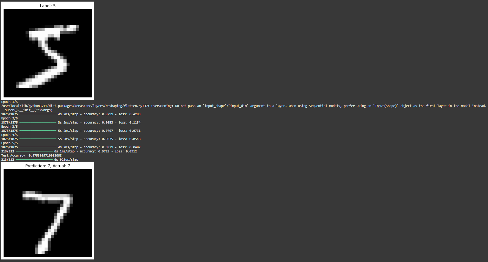

# mnist-digit-classifier
# 🧠 MNIST Digit Classifier (Deep Learning Project)

A simple but powerful deep learning model that classifies handwritten digits (0–9) using the famous MNIST dataset.

This project is beginner-friendly and built using **TensorFlow** and **Keras**, achieving over **97% accuracy** on test data. It's perfect for understanding how Artificial Neural Networks work.

---

## 📌 Project Highlights

- 📊 97%+ accuracy on test images
- 🔢 Trained on 60,000 handwritten digit images
- 🧠 Uses a basic Artificial Neural Network (ANN)
- 🖼 Visualizes predictions vs real labels
- ⚡ Built entirely in **Google Colab**
- 🌎 Easy to understand and modify

---

## 🚀 Tech Stack

| Tool         | Purpose                        |
|--------------|--------------------------------|
| Python       | Programming language           |
| TensorFlow/Keras | Deep learning framework     |
| Matplotlib   | Visualizing predictions        |
| Google Colab | Free GPU-powered training      |

---

## 🧠 How It Works

1. **Load the MNIST dataset** (built into Keras)
2. **Normalize the data** to improve training speed
3. **Build an ANN** with:
   - Input Layer: 28×28 image → Flattened
   - Hidden Layer: 128 neurons with ReLU
   - Output Layer: 10 neurons (softmax)
4. **Train the model** over 5 epochs
5. **Evaluate performance** on test data
6. **Visualize predictions**

---

## 📸 Preview

## 📸 Preview

---

## 🧪 Example Prediction

> Prediction: **7**  
> Actual Label: **7**  
> Confidence: `99.2%`

---

## 🗂 Folder Structure

